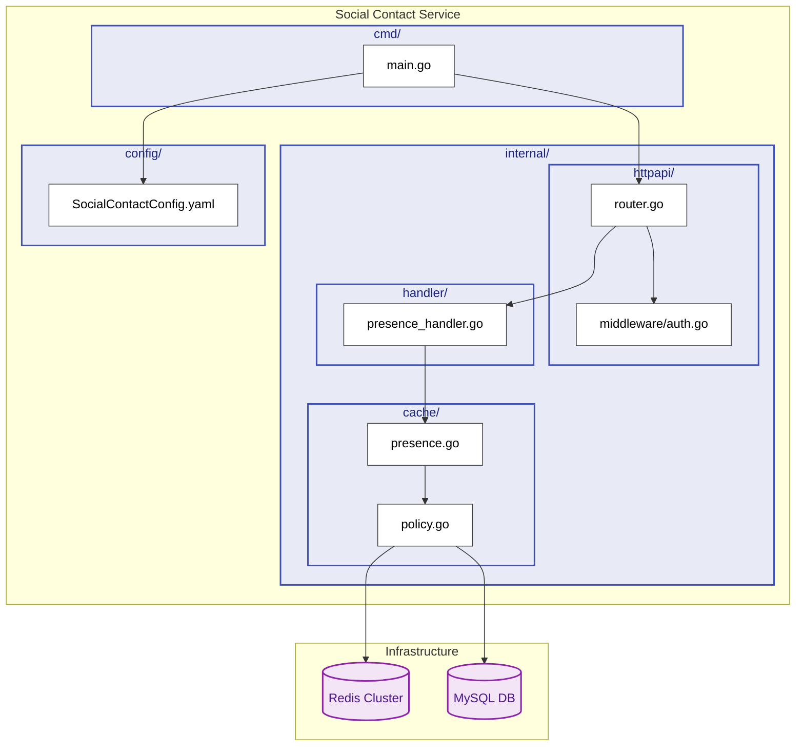

```mermaid
graph TB
    %% 样式定义：加深边框，调整背景色增加对比度
    classDef package fill:#e8eaf6,stroke:#3f51b5,stroke-width:2px,color:#1a237e;
    classDef file fill:#ffffff,stroke:#424242,stroke-width:1px,color:#000000;
    classDef db fill:#f3e5f5,stroke:#8e24aa,stroke-width:2px,color:#4a148c;
    
    subgraph Service [Social Contact Service]
        direction TB
        
        subgraph CMD [cmd/]
            Main[main.go]:::file
        end
        
        subgraph Internal [internal/]
            direction TB
            
            subgraph HttpApi [httpapi/]
                Middleware[middleware/auth.go]:::file
                Router[router.go]:::file
            end
            
            subgraph Handler [handler/]
                PH[presence_handler.go]:::file
            end
            
            subgraph Cache [cache/]
                Presence[presence.go]:::file
                Policy[policy.go]:::file
            end
        end
        
        subgraph Config [config/]
            Conf[SocialContactConfig.yaml]:::file
        end
    end

    subgraph Infrastructure [Infrastructure]
        Redis[(Redis Cluster)]:::db
        MySQL[(MySQL DB)]:::db
    end

    %% 依赖关系
    Main --> Conf
    Main --> Router
    Router --> Middleware
    Router --> PH
    PH --> Presence
    Presence --> Policy
    Policy --> Redis
    Policy --> MySQL

    %% 应用样式
    class CMD,Internal,Config,HttpApi,Handler,Cache package
```